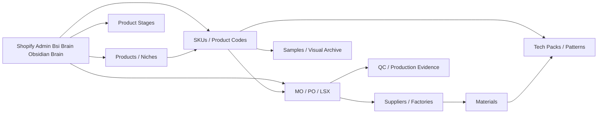

# Brain Data Map

```mermaid
graph LR
  BRAIN["Shopify Admin Bsi Brain Obsidian Brain"]
  PROD["Products / Niches"]
  SKU["SKUs / Product Codes"]
  STAGE["Product Stages"]
  MO["MO / PO / LSX"]
  MAT["Materials"]
  SUP["Suppliers / Factories"]
  QC["QC / Production Evidence"]
  SAMPLE["Samples / Visual Archive"]
  TECH["Tech Packs / Patterns"]
  BRAIN --> PROD
  BRAIN --> SKU
  BRAIN --> STAGE
  BRAIN --> MO
  PROD --> SKU
  SKU --> MO
  SKU --> TECH
  SKU --> SAMPLE
  MO --> QC
  MO --> SUP
  SUP --> MAT
  MAT --> TECH
```
